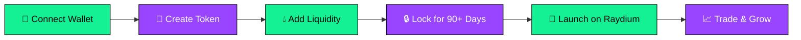

<div align="center">

<!-- Animated Header Banner -->


<!-- Animated Solana Logo -->


<br/>

<!-- Typing Animation -->
[](https://git.io/typing-svg)

<br/>

<!-- Animated Badges -->
<p>


</p>

<p>


</p>

<!-- Live Stats Badges -->
<p>


</p>

<br/>

<!-- Blockchain Animation GIF -->


</div>

---

<div align="center">

## ⚡ What is Team 11?

</div>

<table>
<tr>
<td width="50%">

### 🚀 **The Ultimate Meme Coin Launchpad**

Team 11 is a **premium decentralized platform** for creating and launching meme coins on the **Solana blockchain**. 

With **built-in liquidity locking**, every token launched through our platform comes with guaranteed transparency and trust.

**No coding required.** Just connect your wallet, fill in the details, and launch your token in minutes!

</td>
<td width="50%">

<div align="center">

```
   ╔══════════════════════════════╗
   ║       🌟 TEAM 11 🌟          ║
   ╠══════════════════════════════╣
   ║                              ║
   ║   ◉ Create Token             ║
   ║   ◉ Lock Liquidity           ║
   ║   ◉ Launch on Raydium        ║
   ║   ◉ Build Community          ║
   ║                              ║
   ╚══════════════════════════════╝
```

</div>

</td>
</tr>
</table>

---

<div align="center">

## 🔥 Features

</div>

<table>
<tr>
<td align="center" width="25%">

### 🔒
### **Liquidity Lock**
<sub>Minimum 90-day lock period. Build trust with your community.</sub>

</td>
<td align="center" width="25%">

### ⚡
### **Instant Deploy**
<sub>Create and deploy in minutes. No coding required.</sub>

</td>
<td align="center" width="25%">

### 💰
### **Low Fees**
<sub>Only 0.5% platform fee. Keep more of your gains.</sub>

</td>
<td align="center" width="25%">

### 🛡️
### **Audited**
<sub>Smart contracts verified and secure.</sub>

</td>
</tr>
</table>

---

<div align="center">

## 🌐 Tech Stack

</div>

<div align="center">

<!-- Animated Tech Stack Icons -->
<a href="https://solana.com/"></a>
<a href="https://www.rust-lang.org/"></a>
<a href="https://nextjs.org/"></a>
<a href="https://www.typescriptlang.org/"></a>
<a href="https://nodejs.org/"></a>
<a href="https://expressjs.com/"></a>
<a href="https://supabase.com/"></a>
<a href="https://jestjs.io/"></a>

</div>

<br/>

<div align="center">

| Layer | Technology |
|:-----:|:----------:|
| **Blockchain** |   |
| **Smart Contracts** |  |
| **Frontend** |    |
| **Backend** |   |
| **Database** |   |
| **Wallet** |  |

</div>

---

<div align="center">

## 🎯 How It Works

</div>



<div align="center">

| Step | Action | Description |
|:----:|:------:|:------------|
| **1** | 🔗 **Connect** | Link your Phantom wallet |
| **2** | 📝 **Create** | Set token name, symbol, and supply |
| **3** | 💧 **Liquidity** | Add SOL for initial liquidity pool |
| **4** | 🔒 **Lock** | Secure liquidity for minimum 90 days |
| **5** | 🚀 **Launch** | Token goes live on Raydium DEX |
| **6** | 📈 **Grow** | Build community and watch it moon! |

</div>

---

<div align="center">

## 🚀 Quick Start

</div>

### Prerequisites

```bash
# Required software
node >= 18.0.0
npm >= 8.0.0
solana-cli >= 1.16.0 (for smart contracts)
anchor >= 0.29.0 (for smart contracts)
```

### Installation

```bash
# 1️⃣ Clone the repository
git clone https://github.com/yourusername/team-11.git

# 2️⃣ Navigate to project
cd team-11

# 3️⃣ Install dependencies
npm install

# 4️⃣ Set up environment variables
cp backend/.env.example backend/.env
cp frontend/.env.local.example frontend/.env.local

# 5️⃣ Start development servers
npm run dev
```

### Running Tests

```bash
# Run all tests
npm test

# Run with coverage
npm test -- --coverage

# Backend tests only
npm run test:backend

# Frontend tests only
npm run test:frontend

### 🚀 Deployment
For detailed deployment instructions, see the [Deployment Guide](Docs/DEPLOYMENT.md).
```

---

<div align="center">

## 📁 Project Structure

</div>

```
team-11/
│
├── 📂 frontend/                 # Next.js Web Application
│   ├── 📂 app/                  # App Router pages
│   │   ├── page.tsx             # 🏠 Home page
│   │   ├── dashboard/           # 📊 Token dashboard
│   │   ├── create/              # ➕ Create token
│   │   └── my-tokens/           # 💼 User's tokens
│   ├── 📂 components/           # React components
│   │   ├── ui/                  # 🎨 Design system
│   │   ├── layout/              # 📐 Header, Footer
│   │   └── wallet/              # 👛 Wallet integration
│   └── 📂 providers/            # Context providers
│
├── 📂 backend/                  # Express.js API Server
│   ├── 📂 src/
│   │   ├── routes/              # 🛣️ API endpoints
│   │   ├── controllers/         # 🎮 Request handlers
│   │   ├── services/            # ⚙️ Business logic
│   │   ├── middleware/          # 🔐 Auth, validation
│   │   └── config/              # ⚡ Configuration
│   └── 📂 tests/                # 🧪 Jest tests
│
├── 📂 programs/                 # 🦀 Solana Smart Contracts
│   └── 📂 team-11/              # Anchor program
│
├── 📂 scripts/                  # 🔧 Utility scripts
│   └── setup-database.sql       # 💾 Supabase schema
│
└── 📂 Docs/                     # 📚 Documentation
    └── 📂 phases/               # Development phases
```

---

<div align="center">

## 🔐 Smart Contract Architecture

</div>

```
┌─────────────────────────────────────────────────────────────┐
│                    TEAM 11 PROTOCOL                          │
├─────────────────────────────────────────────────────────────┤
│                                                             │
│  ┌─────────────────┐    ┌─────────────────┐                │
│  │  Token Factory  │───▶│   SPL Token     │                │
│  │    Program      │    │   Creation      │                │
│  └────────┬────────┘    └─────────────────┘                │
│           │                                                 │
│           ▼                                                 │
│  ┌─────────────────┐    ┌─────────────────┐                │
│  │ Liquidity Lock  │───▶│   Raydium AMM   │                │
│  │    Vault        │    │   Integration   │                │
│  └────────┬────────┘    └─────────────────┘                │
│           │                                                 │
│           ▼                                                 │
│  ┌─────────────────────────────────────────┐               │
│  │        Time-Locked LP Token Vault        │               │
│  │  ┌─────┐  ┌─────┐  ┌─────┐  ┌─────┐    │               │
│  │  │90d  │  │180d │  │365d │  │ 2yr │    │               │
│  │  └─────┘  └─────┘  └─────┘  └─────┘    │               │
│  └─────────────────────────────────────────┘               │
│                                                             │
└─────────────────────────────────────────────────────────────┘
```

---

<div align="center">

## 📊 Development Phases

</div>

<div align="center">

| Phase | Status | Description |
|:-----:|:------:|:------------|
| **Phase 0** | ✅ Complete | Project Setup & Design System |
| **Phase 1** | ✅ Complete | Solana Smart Contracts |
| **Phase 2** | ✅ Complete | Backend API Development |
| **Phase 3** | ✅ Complete | Frontend Integration |
| **Phase 4** | ✅ Complete | Testing & Deployment |


</div>

---

<div align="center">

## 🤝 Contributing

</div>

We love contributions! Please read our [Contributing Guide](CONTRIBUTING.md) to get started.

```bash
# Fork the repo, then:
git checkout -b feature/amazing-feature
git commit -m 'Add amazing feature'
git push origin feature/amazing-feature
# Open a Pull Request
```

---

<div align="center">

## 📜 License

</div>

<div align="center">

This project is licensed under the **MIT License** - see the [LICENSE](LICENSE) file for details.

<br/>

---

<br/>

## 🌟 Star History

[](https://star-history.com/#yourusername/team-11&Date)

<br/>

---

<br/>

### 💜 Built with love on Solana

<br/>

<a href="https://solana.com">

</a>

<br/><br/>

**Made with 💚 by the Team 11**

<br/>


</div>
